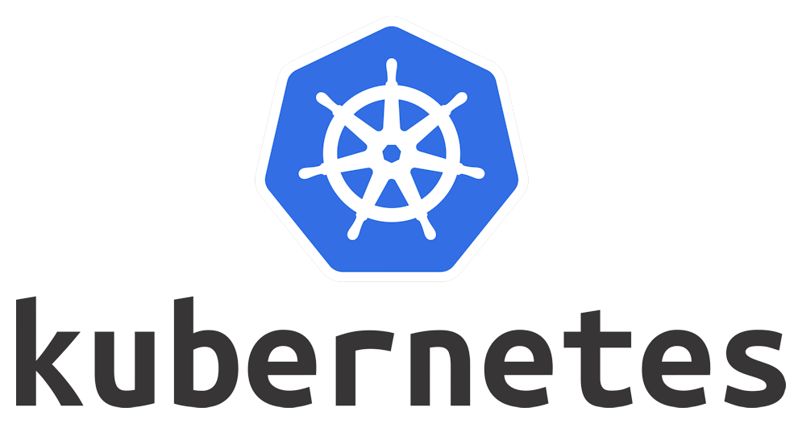

# Scheduling control in Kubernetes


This article is intended to overview the capabilities of Scheduling Kubernetes process management and describe, how
their
usage can improve the quality of system.

## Scheduling overview

Scheduling is the process of distributing [pods](https://kubernetes.io/docs/concepts/workloads/pods/) to
the [nodes](https://kubernetes.io/docs/concepts/architecture/nodes/). In other words,the process of determining, on
which
physical\virtual machines the cluster containers will be located.

Basic Kubernetes scheduler is
the [kube-scheduler](https://kubernetes.io/docs/concepts/scheduling-eviction/kube-scheduler/).
It doesn't require some specific settings for the default behavior. Scheduler will try to place pods uniformly between
nodes,
according to the pods resource requirements. Basic scheduler can be replaced with the custom one. It could
be written manually, the main requirement is compliance to the specific API. You can see the
example [here](https://developer.ibm.com/articles/creating-a-custom-kube-scheduler/).
Otherwise, in this article will be described only the capabilities of the kube-scheduler.

## Why it is important?

As it was said before, Kubernetes can perform the scheduling without extra instructions. However, appropriate
configuration
of the scheduling may significantly increase the security, reliance and fault tolerance of the cluster.

## NodeName

`nodeName` is the way to place Pod under the certain Node by it's name. This approach ignores the other scheduling settings.
If the Node with specified name doesn't exist or hasn't available resources, the Pod won't eun. Example of `nodeName` usage:
```yaml
apiVersion: v1
kind: Pod
metadata:
  name: nginx
spec:
  containers:
  - name: nginx
    image: nginx
  nodeName: node-1
```

## Taints and toleration

A taint is a node setting that allows to block it from adding Pods. This mechanism can be used, for example, to reserve
a Node for a future cluster extending, if it is planned.

The taint to the node `exNode` with `key=exKey`, `value=exValue` and `exEffect` effect can be added using the following
command:

```
kubectl taint nodes exNode exKey=exValue:exEffect
```

Key and value could be arbitrary. For taint effect, three values are available:

1. `NoSchedule` - new pods that do not match the taint are not scheduled onto the node, existing pods remain
2. `PreferNoSchedule` - new pods that do not match the taint are not scheduled onto the node, if there is another
   free space for it, existing pods remain
3. `NoExecute ` - new pods that do not match the taint are not scheduled onto the node, existing pods will be removed

Following command will remove the taint from node:

```
kubectl taint nodes exNode exKey=exValue:exEffect-
```

Tolerations are applied to Pods. Toleration allows a Pod to overcome the Node taint. It is added to `spec.tolerations`
Pod
manifest part.

Here you can see the example of Tolerations. Both of them "match" to the Taint example:

```yaml
tolerations:
  - key: "exKey"
    operator: "Exists"
    effect: "NoSchedule"
```

```yaml
tolerations:
  - key: "exKey"
    operator: "Equal"
    value: "exValue"
    effect: "NoSchedule"
```

A toleration "matches" a taint if the keys are the same and the effects are the same, and:

+ the operator is Exists (in which case no value should be specified), or
+ the operator is Equal and the values are equal.

## NodeSelector and nodeAffinity

`NodeSelector` is the simplest approach for the allocation management. It is a part of Pod manifest and describes
the labels of Nodes, where the Pod can be placed, in key-value mapping format. Example:

```yaml
apiVersion: v1
kind: Pod
metadata:
  name: sensitive-storage
  labels:
    env: prod
spec:
  containers:
    - name: sensitive-storage-container
      image: sensitive-storage-image
      imagePullPolicy: IfNotPresent
  nodeSelector:
    security: high
```

The Pod, containing storage for sensitive users' information, should be deployed to a specifically labeled node (with
label `security=high`), which is
physically high secured machine using the given manifest.

`nodeSelector` only selects nodes with all the specified labels For some cases, it is not flexible enough. There is
a more expressive, but complicated feature called `nodeAffinity`. It gives more control on selection logic.

`nodeAffinty` is conceptually similar to `nodeSelector`, it also based on the node labels, but gives opportunity to 
describe an operator between labels keys and labels available values. Also, the `AND`\ `OR` expressions combination is supported.

There are two types of `nodeAffinity`:

+ `requiredDuringSchedulingIgnoredDuringExecution` - The scheduler can't schedule the Pod unless the rule is met.
  This functions like nodeSelector, but with a more expressive syntax. Structure:

```yaml
spec:
  affinity:
    nodeAffinity:
      requiredDuringSchedulingIgnoredDuringExecution:
        nodeSelectorTerms:
          - matchExpressions:
              - key: { affinityKey }
                operator: { affinityOperator }
                values:
                  - { affinityValues }
```

+ `preferredDuringSchedulingIgnoredDuringExecution` - The scheduler tries to find a node that meets the rule. If a
  matching node is not found, scheduler will place node in some available. Structure:

```yaml
spec:
  affinity:
    nodeAffinity:
      preferredDuringSchedulingIgnoredDuringExecution:
        - weight: { affinityWeight }
          preference:
            - matchExpressions:
                - key: { affinityKey }
                  operator: { affinityOperator }
                  values:
                    - { affinityValues }
```

`affinityKey` is the key of label to find matching node, `affinityValues` is the set of label values. `affinityOperator`
is the operator to find the compliance between defined in `affinityKey`\ `affinityValues` and key\value of node labels.

The following values are supported for `affinityOperator`:
 + `In` -  any of the listed values are relevant
 + `NotIn` - opposite to `In`
 + `Exists` - the label exists, value is ignored
 + `DoesNotExists` - opposite to `Exists`
 + `Gt` - the label value is greater than the value in policy. Applicable for numeric label values only.
 + `Lt` - opposite to `Gt`

The multiple terms under `nodeSelectorTerms` are combined within `OR` logical operator (if only one of the terms is satisfied, 
the Pod can be placed on the Node). The multiple expressions under `matchExpressions` are combined within logical `AND`.

An `affinityWeight` can be specified for `preferredDuringSchedulingIgnoredDuringExecution` nodeAffinity and applicable for
cases with several. It's value can be from 1 to 100 and applicable for node. When scheduler find suitable for pod node candidate,
it iterates over the rules and summarizes the weights of rules, which the node candidate is matching. Then, scheduler chose
the node candidate with the biggest weight and places the pod there.

Example of `nodeAffinity` usage can be grading the nodes by their performance, stability and reliability. Modern and powerful
devices may be used for the important high-loaded component, outdated - for rarely-used legacy services.

##  PodAffinitty and PodAntiAffinitty

Working principle of `podAffinity` and `podAntiAffinity` are the similar to `nodeAffinity`, but describe the rules
based on the labels of Pods, already existing in the cluster. 

The structure of the configuration is the following: 
```yaml
apiVersion: v1
kind: Pod
metadata:
  name: { name }
spec:
  affinity:
    podAffinity:
      requiredDuringSchedulingIgnoredDuringExecution:
      - labelSelector:
          matchExpressions:
          - key: { podAffinityKey }
            operator: { podAffinityOperator }
            values:
            - { values }
        topologyKey: { topologyKey }
    podAntiAffinity:
      preferredDuringSchedulingIgnoredDuringExecution:
      - weight: 100
        podAffinityTerm:
          labelSelector:
            matchExpressions:
            - key: { podAntiAffinityKey }
              operator: { podAntiAffinityOperator }
              values:
              - { values }
          topologyKey: { topologyKey }
  containers:
  - name: { containerName }
    image: { containerImage}
```

`podAffinity` places the Pods on Node with another matching the expressions in `labelSelector`, `podAntiAffinity` is opposite.
`In`, `NotIn`, `Exists` and `DoesNotExist` operators are supported for `podAffinity` and `podAntiAffinity`.

The obvious example of `podAffinity` and `podAntiAffinity` usage is avoid placing the each Pod of Deployment in a single node.
It a single node breaks, it will be guaranteed, that there are another replicas of Deployment on some other nodes, and the system
workability won't be lost. It can be made with the following example: 
```yaml
apiVersion: apps/v1
kind: Deployment
metadata:
  name: web-server-2
  labels:
    app: web-server-2
spec:
  replicas: 2
  selector:
    matchLabels:
      app: web-server-2
  template:
    metadata:
      labels:
        app: web-server-2
    spec:
      containers:
        - name: web-server-2
          image: ifilyaninitmo/itdt-contained-frontend:master
          ports:
            - containerPort: 3000
          envFrom:
            - configMapRef:
                name: env-config
      affinity:
        podAntiAffinity:
          requiredDuringSchedulingIgnoredDuringExecution:
            - labelSelector:
                matchExpressions:
                  - key: app
                    operator: In
                    values:
                      - web-server-2
              topologyKey: "topology.kubernetes.io/zone"
```

Nodes can be divided into domains. The domain is determined by the value of special system Kubernetes label, 
e.g. `topology.kubernetes.io/zone`. Domain can be a certain region, zone, rack ... The nodes with the same label values
are belonging to the same domains. If `topologyKey` is specified, the `podAffinity` and `podAntiAffinity` spread the  
Pods and find the existing by Domains instead of single Nodes, value of `topologyKey` is the name of node label, the domains
topology is organized by. You can read about domains in details [here](https://kubernetes.io/docs/reference/labels-annotations-taints/#topologykubernetesiozone).

## Spread topology constraints

Pod affinity and anti-affinity rules functionality is not applicable when there is a task to spread an arbitrary number 
of pods between few domains. The only way was to develop the custom scheduler to replace the default.
Spread topology constraints were introduced in 1.16 Kubernetes version. This configuration allow to distribute
the Pods evenly between the Domains. Example of usage with explanation of main fields meaning:
```yaml
apiVersion: v1
kind: Pod
metadata:
  name: myapp
  labels:
    app: myapp
spec:
  # Configure a topology spread constraint
  topologySpreadConstraints:
    - maxSkew: 1 # Maximum permitted difference in the number of Pods between the Domains
      topologyKey: topology.kubernetes.io/zone # Name of system node label, by which the domains are organized
      whenUnsatisfiable: DoNotSchedule # What to do if there is no suitable Domain: DoNotSchedule/ScheduleAnyway 
      labelSelector: # Name of label, by which the Pods are distributed
        matchLabels:
          app: myapp
```
You can read more about Topology spread constraints [here](https://kubernetes.io/docs/concepts/scheduling-eviction/topology-spread-constraints/).

## Priority of configurations

The most prioritized rule is NodeName, it ignores the other Scheduler configurations. Then, the taints block Node from Pods, 
which haven't appropriate toleration's. Finally, the all remaining rules (Node selector, Node affinity, Pod-affinity ...)
must be equally followed.

## References

+ https://redhat-scholars.github.io/kubernetes-tutorial/kubernetes-tutorial/taints-affinity.html
+ https://docs.openshift.com/container-platform/3.11/admin_guide/scheduling/index.html
+ https://kubernetes.io/docs/tasks/configure-pod-container/assign-pods-nodes/
+ https://kubernetes.io/docs/concepts/scheduling-eviction/
+ https://komodor.com/learn/node-affinity/
+ https://www.densify.com/kubernetes-autoscaling/kubernetes-affinity


