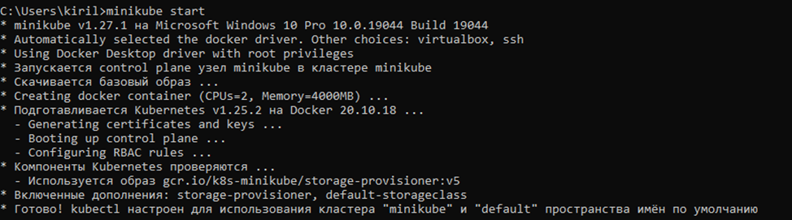
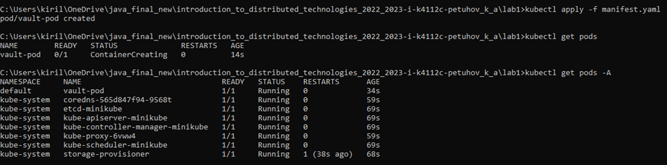
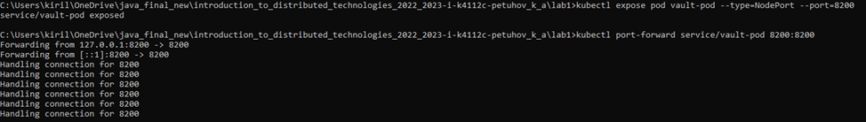
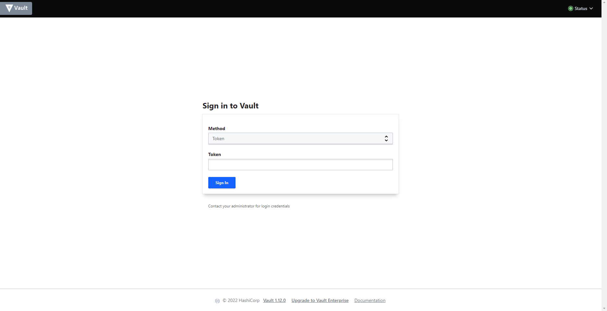
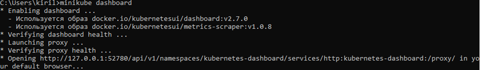
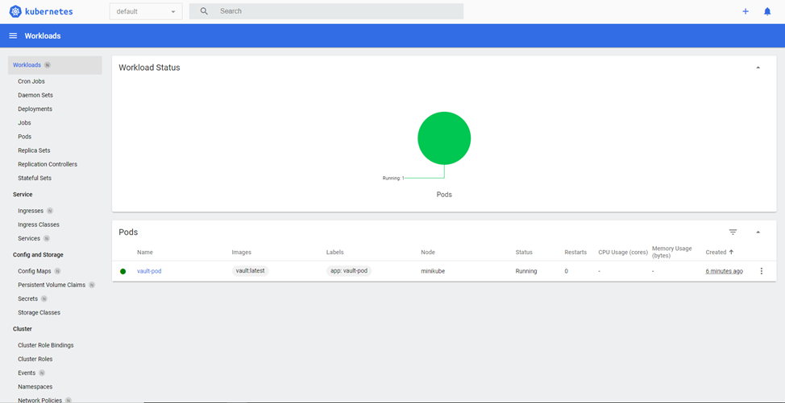
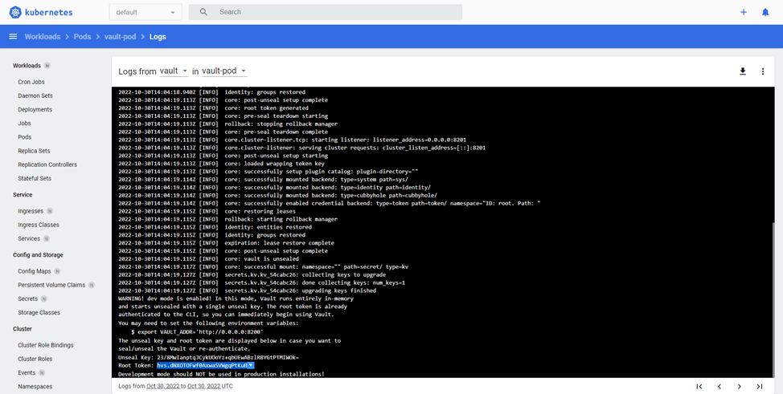
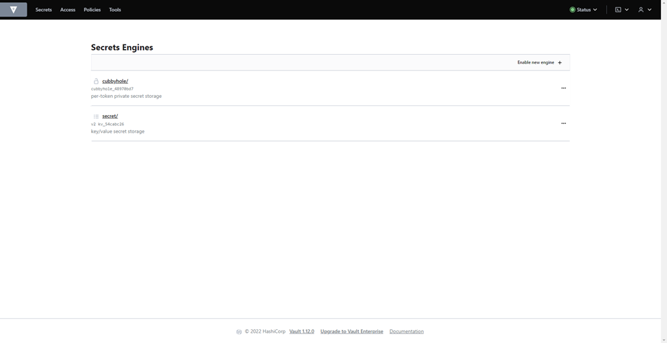
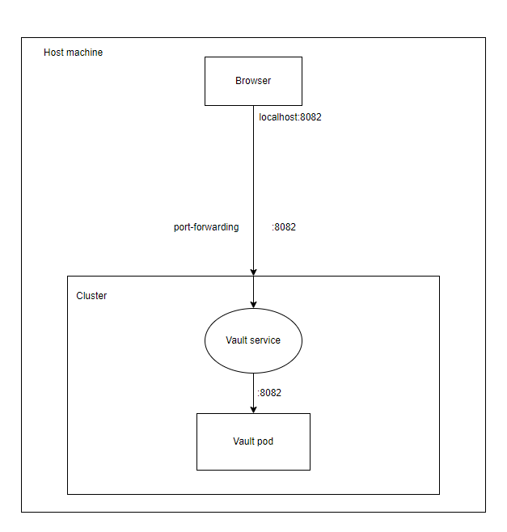

University: ITMO University

Faculty: FICT

Course: Introduction to distributed technologies

Year: 2022/2023

Group: K4112c

Author: Petuhov Kirill Artemovich

Lab: Lab1

Date of create: 24.10.2022

Date of finished: TBD

# Progress of work
## 1. Minikube installation

Firstly, minikube was installed by installation guide from the official site: https://minikube.sigs.k8s.io/docs/start/
After installation, minikube cluster was started by docker driver



## 2. Creation and applying of the manifest

Further it was necessary to create pod manifest and apply it for kubernetes cluster. 

Manifest is present below:
```yaml
apiVersion: v1
kind: Pod
metadata:
  name: vault-pod
  labels:
    app: vault-pod
spec:
  containers:
    - name: vault
      image: vault:latest
      ports:
        - containerPort: 8200
```

Then a pod manifest was applied and pod existence was validated:


## 3. Creation of the service and forwarding the service port

After the creation of pod, pod service was created and its port was forwarded from the cluster


Access to the Vault was checked: 


## 4. Authenticate to Vault

For authentication, Vault token is required, it could be found on logs of Vault Pod. Vault log was accessed 
via Kubernetes dashboard:





Authentication succeeded:



## 5. Overall system diagram

