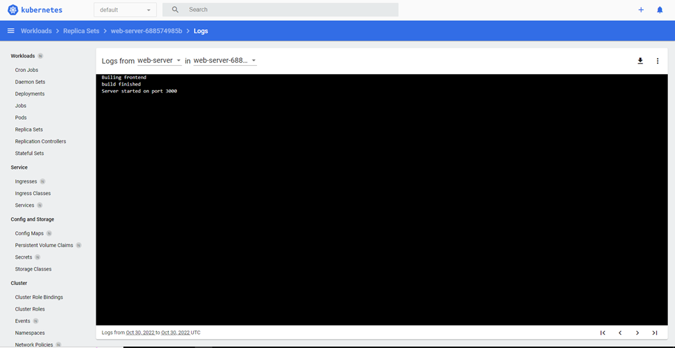
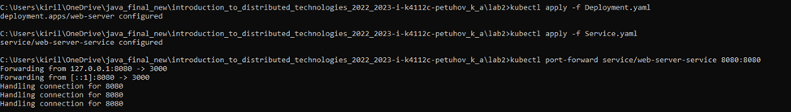
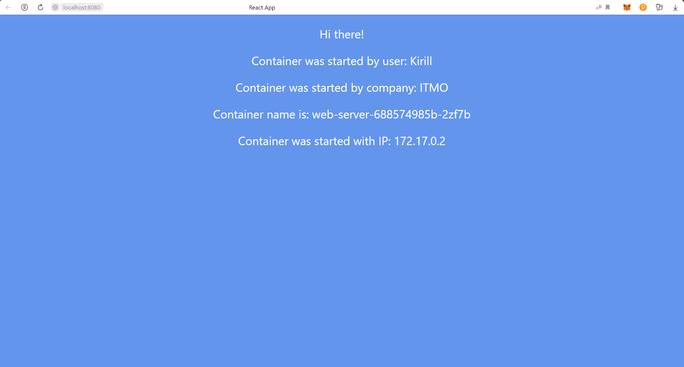
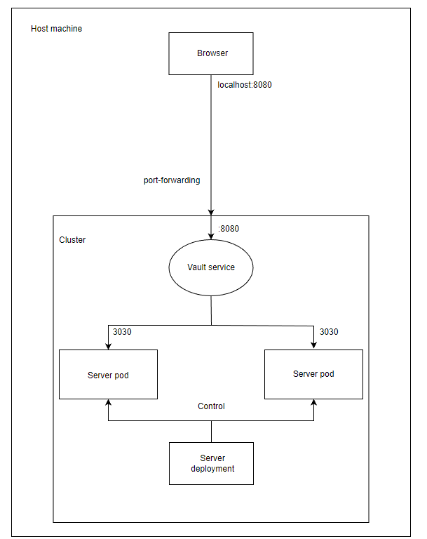

University: ITMO University

Faculty: FICT

Course: Introduction to distributed technologies

Year: 2022/2023

Group: K4112c

Author: Petuhov Kirill Artemovich

Lab: Lab2

Date of create: 28.10.2022

Date of finished: TBD

# Progress of work

## 1. Creation of the deployment manifest

Further it was necessary to create deployment manifest. 

Manifest is present below:
```yaml
apiVersion: apps/v1
kind: Deployment
metadata:
  name: web-server
  labels:
    app: web-server
spec:
  replicas: 2
  selector:
    matchLabels:
      app: web-server
  template:
    metadata:
      labels:
        app: web-server
    spec:
      containers:
        - name: web-server
          image: ifilyaninitmo/itdt-contained-frontend:master
          ports:
            - containerPort: 3000
          env:
            - name: REACT_APP_USERNAME
              value: "Kirill"
            - name: REACT_APP_COMPANY_NAME
              value: "ITMO"
```
Port of the web server was found from after preliminary Deployment logs on Kubernetes dashboard



## 2. Creation of the service manifest

After the creation of deployment, manifest of service for Deployment pods was created.
```yaml
apiVersion: v1
kind: Service
metadata:
  name: web-server-service
spec:
  selector:
    app: web-server
  ports:
    - protocol: TCP
      port: 8080
      targetPort: 3000
```

## 3. Apply the created manifest



## 4. Open the server local address in browser



Values of the environment variables could be seen in web page

## 5. Overall system diagram


