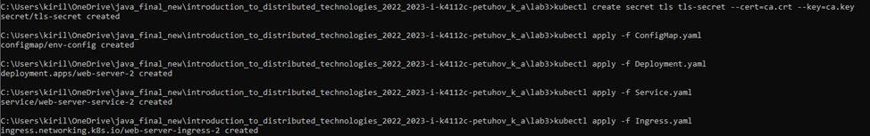
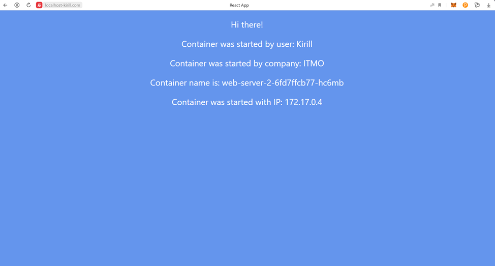
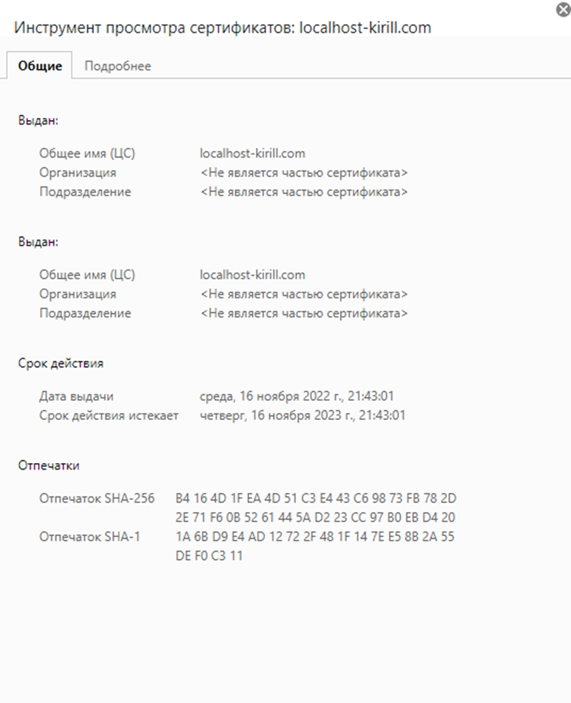
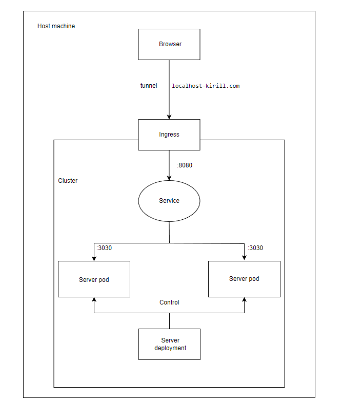

University: ITMO University

Faculty: FICT

Course: Introduction to distributed technologies

Year: 2022/2023

Group: K4112c

Author: Petuhov Kirill Artemovich

Lab: Lab3

Date of create: 15.11.2022

Date of finished: TBD

# Progress of work
## 1. Create tls certificate and secret
ca.crt and ca.key files were generated via the following commands:

```
openssl genrsa -out ca.key 2048
openssl req -x509 -new -nodes -days 365 -key ca.key -out ca.crt -subj "/CN=localhost-kirill.com"
```
TLS secret was created via the following command:
```
kubectl create secret tls tls-secret --cert=ca.crt --key=ca.key  
```
## 2. Create manifests

Further it was necessary to create ConfigMap, Deployment, Service and Ingress manifests.

ConfigMap manifest is present below:
```yaml
apiVersion: v1
kind: ConfigMap
metadata:
  name: env-config
data:
  REACT_APP_USERNAME: Kirill
  REACT_APP_COMPANY_NAME: ITMO
```

Deployment manifest is present below:
```yaml
apiVersion: apps/v1
kind: Deployment
metadata:
  name: web-server-2
  labels:
    app: web-server-2
spec:
  replicas: 2
  selector:
    matchLabels:
      app: web-server-2
  template:
    metadata:
      labels:
        app: web-server-2
    spec:
      containers:
        - name: web-server-2
          image: ifilyaninitmo/itdt-contained-frontend:master
          ports:
            - containerPort: 3000
          envFrom:
            - configMapRef:
                name: env-config
```

Service manifest is present below:
```yaml
apiVersion: v1
kind: Service
metadata:
  name: web-server-service-2
spec:
  selector:
    app: web-server-2
  ports:
    - protocol: TCP
      port: 8080
      targetPort: 3000
```

Ingress manifest is present below:
```yaml
apiVersion: networking.k8s.io/v1
kind: Ingress
metadata:
  name: web-server-ingress-2
spec:
  rules:
    - host: localhost-kirill.com
      http:
        paths:
          - backend:
              service:
                name: web-server-service-2
                port:
                  number: 8080
            path: /
            pathType: Prefix
  tls:
    - hosts:
        - localhost-kirill.com
      secretName: tls-secret
```

## 3. Configure the minikube and host system

It was necessary to add a few addons for minikube:
```
minikube addons enable ingress
minikube addons enable ingress-dns
```

The following line was added to hosts Windows file for enabling access to tunnel via domain name:


## 4. Apply the manifests

The whole manifests were applied to cluster:


## 5. Create the tunnel
When ingress created, it will be necessary to create the tunnel via the following command:
```
minikube tunnel
```

## 6. Check results

The application was accessed via configured domain name localhost-kirill.com:



Certificate data:



## 7. Overall system diagram

