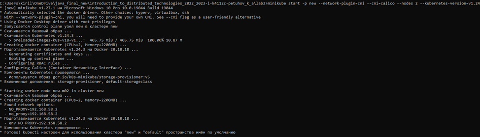
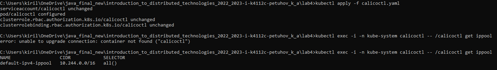
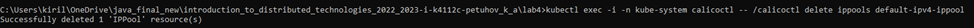
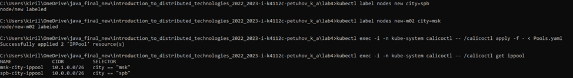
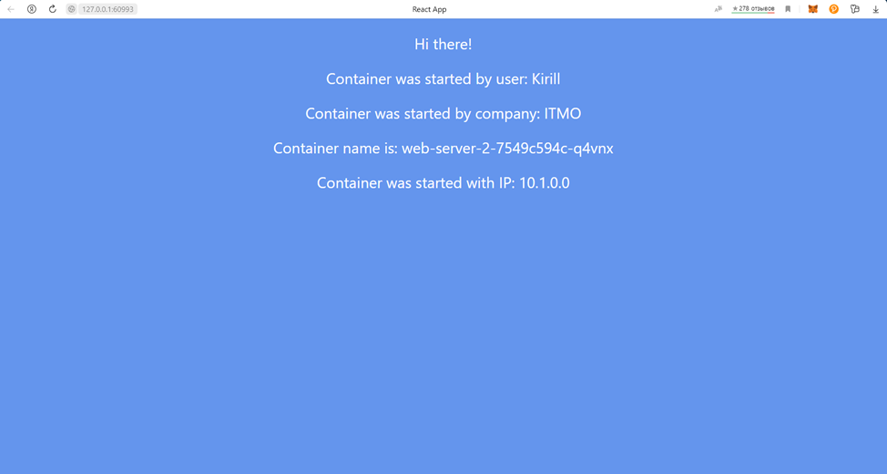
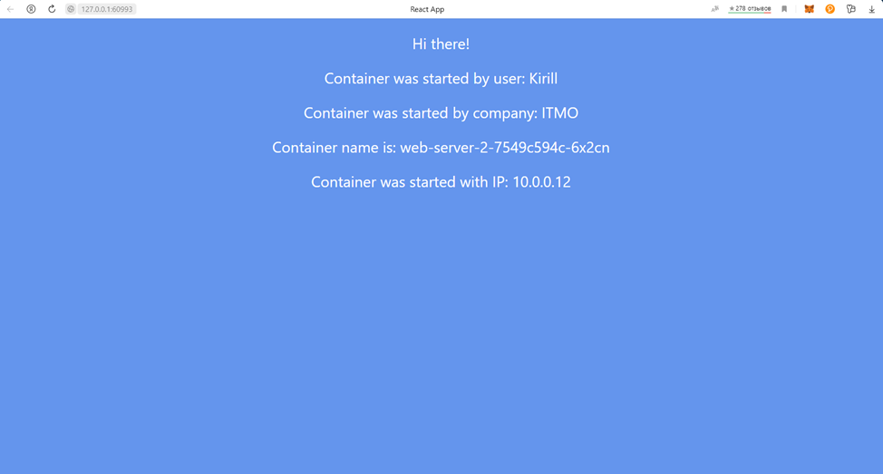
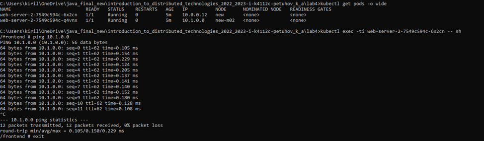
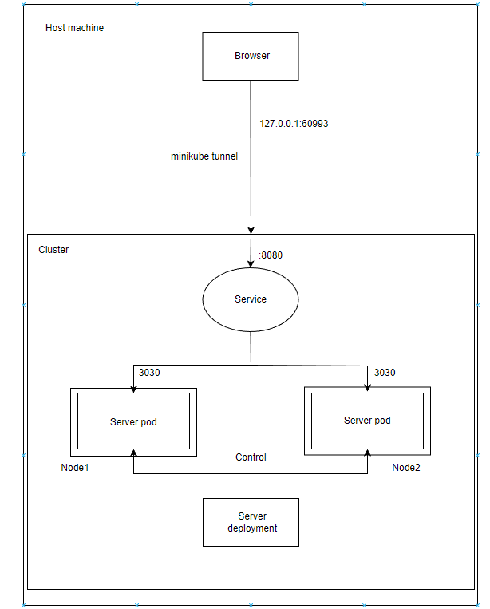

University: ITMO University

Faculty: FICT

Course: Introduction to distributed technologies

Year: 2022/2023

Group: K4112c

Author: Petuhov Kirill Artemovich

Lab: Lab4

Date of create: 15.11.2022

Date of finished: TBD

# Progress of work
## 1. Create cluster
Two-nodes cluster was created with the following commands:


## 2. Configure calico with manifest



## 3. Delete default IP Pool



## 4. Create the IP Pool manifests

The Ip Pool manifests are present below:
```yaml
apiVersion: projectcalico.org/v3
kind: IPPool
metadata:
  name: spb-city-ippool
spec:
  cidr: 10.0.0.0/26
  ipipMode: Always
  natOutgoing: true
  nodeSelector: city == "spb"

---
apiVersion: projectcalico.org/v3
kind: IPPool
metadata:
  name: msk-city-ippool
spec:
  cidr: 10.1.0.0/26
  ipipMode: Always
  natOutgoing: true
  nodeSelector: city == "msk"
```

## 5. Label the nodes and apply Pool manifests


## 6. Create and apply Deployment and Service manifest
Deployment manifest:
```yaml
apiVersion: apps/v1
kind: Deployment
metadata:
  name: web-server-2
  labels:
    app: web-server-2
spec:
  replicas: 2
  selector:
    matchLabels:
      app: web-server-2
  template:
    metadata:
      labels:
        app: web-server-2
    spec:
      containers:
        - name: web-server-2
          image: ifilyaninitmo/itdt-contained-frontend:master
          ports:
            - containerPort: 3000
          envFrom:
            - configMapRef:
                name: env-config
      affinity:
        podAntiAffinity:
          requiredDuringSchedulingIgnoredDuringExecution:
            - labelSelector:
                matchExpressions:
                  - key: app
                    operator: In
                    values:
                      - web-server-2
              topologyKey: "kubernetes.io/hostname"
```
The 'affinity' section is used to guarantee that pods will be deployed to different node.

Service manifest:
```yaml
apiVersion: v1
kind: Service
metadata:
  name: web-server-service-2
spec:
  selector:
    app: web-server-2
  ports:
    - protocol: TCP
      port: 8080
      targetPort: 3000
```
## 7. Create tunnel
It will be necessary to create the tunnel via the following command:
```
minikube tunnel
```

## 8. Check results

The application was accessed via tunnel:





In case of connection to different Pods, IP addresses are matched to different Pools. That means, the pods are deployed 
to different nodes, and pools are assigned correctly.

Then, the opportunity of one Pod connection to another was investigated:


## 7. Overall system diagram

